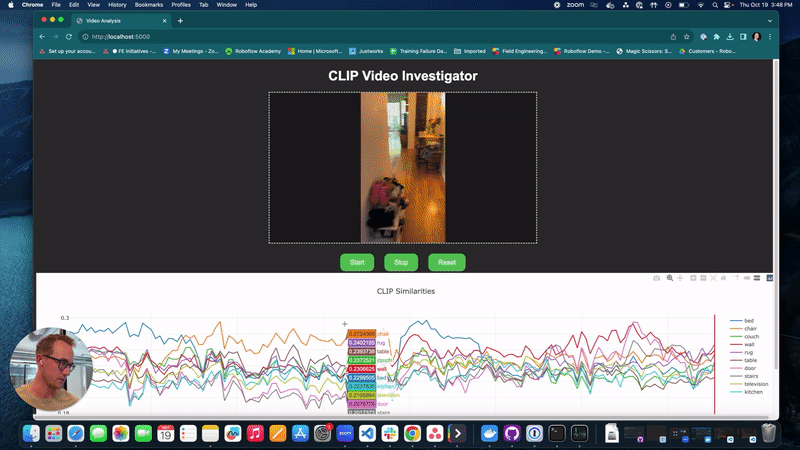

# CLIP Video Investigator



## Overview

CLIP Video Investigator is a Flask-based web application designed to compare text and image embeddings using the CLIP model. The application integrates OpenCV for video processing and Plotly for data visualization to accomplish the following:

1. Play a video in a web browser.
2. Pause and resume video playback.
3. Compare CLIP embeddings of video frames with text embeddings.
4. Visualize the similarity between text and image embeddings in real-time using a Plotly plot.
5. Jump to specific frames by clicking on the Plotly plot.

Youtube video: https://www.youtube.com/watch?v=XllrtZnPL6M

### Why This is Useful

Understanding the relationship between text and image embeddings can provide insights into how well a model generalizes across modalities. By plotting these values in real-time, researchers and engineers can:

- Identify key frames where text and image embeddings are highly aligned or misaligned.
- Debug and fine-tune the performance of multimodal models.
- Gain insights into the temporal evolution of embeddings in video data.
- Enable more effective search and retrieval tasks for video content.

## Features

- **Video Playback**: Uses OpenCV to read video frames and displays them in the web browser.
  
- **Play/Pause**: Allows the user to start and stop video playback.

- **Data Visualization**: Uses Plotly to plot data related to the video frames.

- **Interactive Plot**: Allows the user to click on the plot to jump to specific frames in the video.

- **Reset Functionality**: Resets the application to its initial state.

- **Embedding Caching**: Pickle files of the text and image frame embeddings are saved for each video in the `/embeddings` folder. This allows for quicker subsequent analysis by avoiding the need to regenerate these embeddings.

## Configuration

A `config.yaml` file is used to specify various settings for the application:

```yaml
roboflow_api_key: ""  # Roboflow API key
video_path: ""  # Path to video file
CLIP:
  - wall
  - tile wall
  - large tile wall
```

- `roboflow_api_key`: Your API key for Roboflow.
- `video_path`: The path to the video file you want to analyze.
- `CLIP`: A list of text inputs for which you want to generate CLIP embeddings.

## Folder Layout

```
clip_investigator/
├── config.yaml
├── scripts/
│   └── example.pkl
├── embeddings/
│   └── clip_app.py
│   └── clip_functions.py
├── static/
│   ├── css/
│   │   └── style.css
│   └── js/
│       └── main.js
└── templates/
    └── index.html
```

- `clip_app.py`: The main Flask application file.
- `config.yaml`: Configuration file for specifying settings.
- `embeddings/`: Folder where pickle files of text and image embeddings are stored.
- `static/`: Contains static files like CSS and JavaScript.
- `templates/`: Contains HTML templates.

## Installation

### Prerequisites

- Python 3.x
- Virtualenv (optional but recommended)

### Steps

1. Clone the repository.
    ```bash
    git clone https://github.com/roboflow/clip_video_app.git
    ```

2. Navigate to the project directory.
    ```bash
    cd  clip_video_app
    ```

3. (Optional) Create a virtual environment.

4. Install the dependencies.
    ```bash
    pip install -r requirements.txt
    ```

## Usage
**You must also be running the roboflow inference server localy!**

0. Update the `config.yaml` file with your Roboflow API key and the path to your video file (or use sample file in /data folder).

1. Start the Flask application.
    ```bash
    python scripts/clip_app.py
    ```

2. Open a web browser and navigate to `http://localhost:5000`.

3. Use the "Start" and "Stop" buttons to control video playback.

4. View real-time data related to the video in the Plotly plot below the video.

5. Click on the Plotly plot to jump to specific video frames.

## Troubleshooting

- **WebSocket Errors**: If you encounter WebSocket errors, check the browser console for specific error messages. The application has built-in error handling to attempt reconnections.

- **Plotly Click Events**: If click events are not detected on the Plotly plot after a reset, reload the page.

